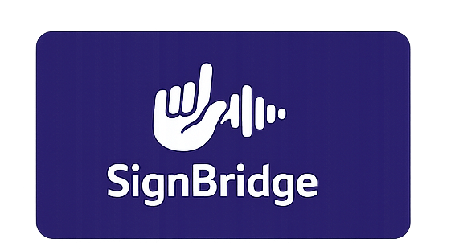
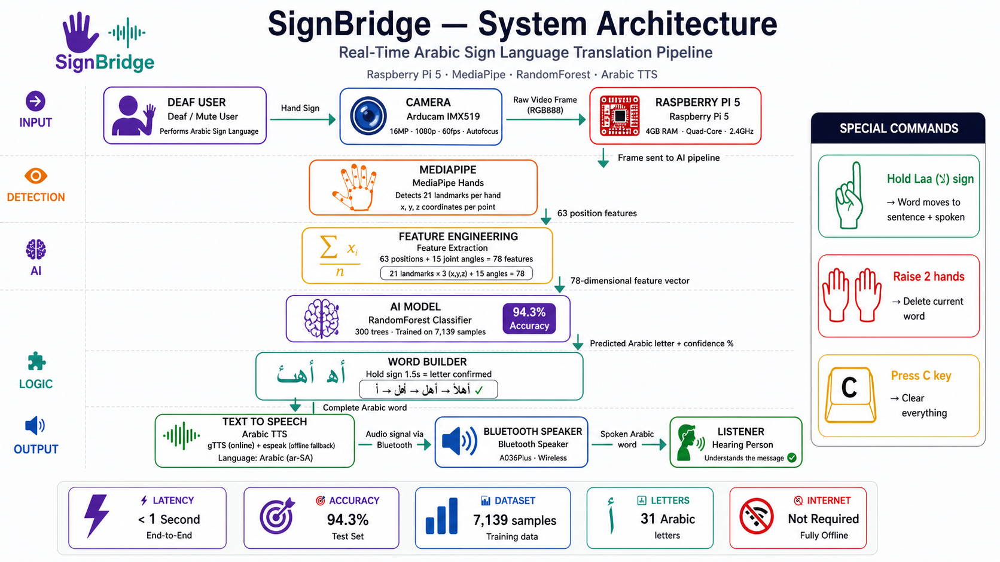
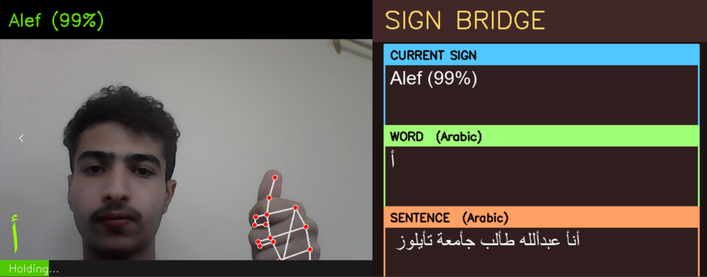
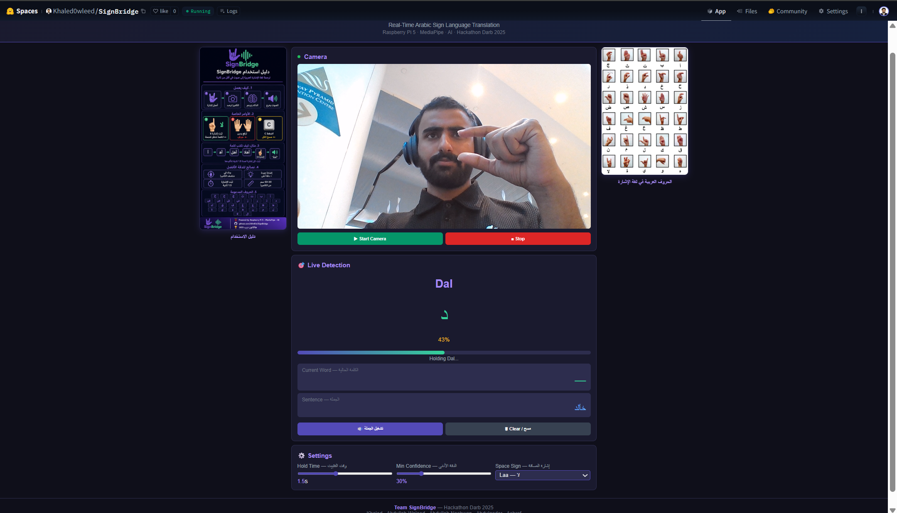
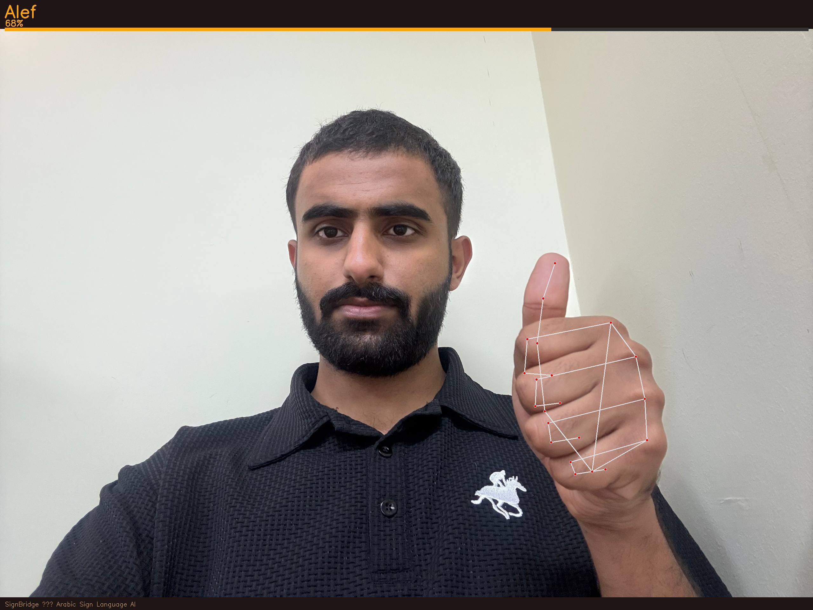
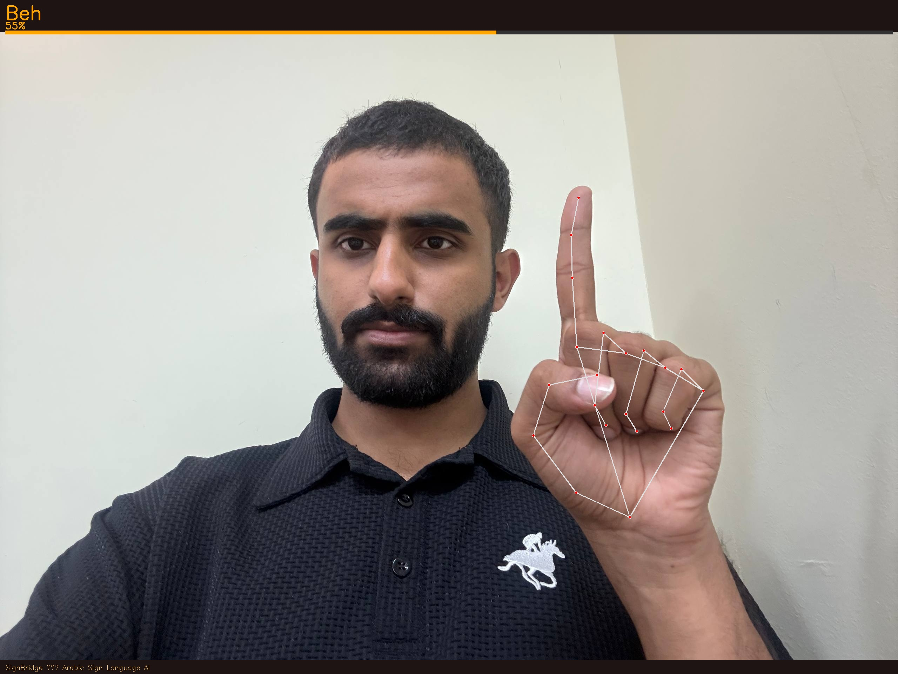
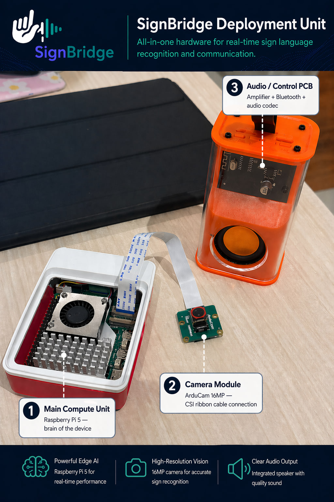
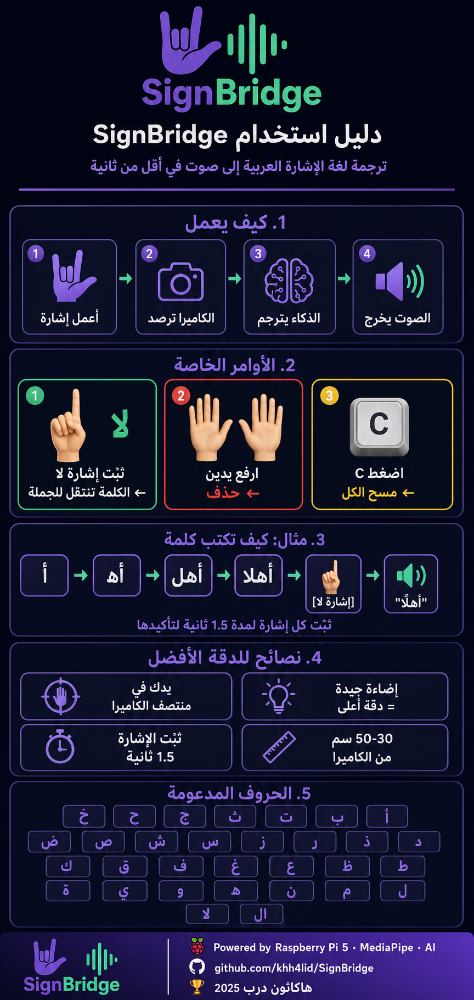
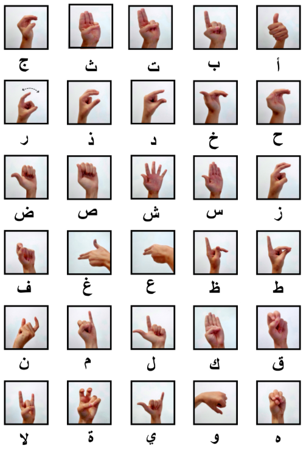

<div align="center">



# SignBridge

### Real-Time Arabic Sign Language to Speech Translation

[](https://huggingface.co/spaces/Khaled0wleed/SignBridge)
[](https://github.com/khh4lid/SignBridge)
[](https://github.com/khh4lid/SignBridge)
[](LICENSE)
[](https://github.com/khh4lid/SignBridge)
[](https://github.com/khh4lid/SignBridge)

*Giving Voice to the Silent — إعطاء صوت للصامتين*


</div>

---

## 📋 Table of Contents

- **[👥 Team Members](#-team-members)**
- **[🎯 General](#-general)**
  - [Description](#description)
  - [Problem Statement](#problem-statement)
  - [Our Solution](#our-solution)
  - [Features](#features)
  - [System Architecture](#system-architecture)
- **[📸 Visual Demo](#-visual-demo)**
- **[📖 Usage Guide](#-usage-guide)**
- **[🛠️ Hardware Setup](#️-hardware-setup)**
  - [Required Components](#required-components)
  - [Camera Configuration](#camera-configuration)
  - [Bluetooth Speaker Setup](#bluetooth-speaker-setup)
- **[🧠 AI Model](#-ai-model)**
  - [Dataset](#dataset)
  - [Feature Extraction](#feature-extraction)
  - [Training](#training)
  - [Evaluation Results](#evaluation-results)
- **[⚙️ Software Pipeline](#️-software-pipeline)**
  - [Camera Module](#camera-module)
  - [Hand Detection](#hand-detection)
  - [Predictor](#predictor)
  - [Word Builder](#word-builder)
  - [Text to Speech](#text-to-speech)
- **[🌐 Web Demo](#-web-demo)**
  - [FastAPI Backend](#fastapi-backend)
  - [Frontend Interface](#frontend-interface)
  - [How to Use](#how-to-use)
- **[🚀 Installation & Running](#-installation--running)**
  - [Quick Start](#quick-start)
  - [Run on Raspberry Pi](#run-on-raspberry-pi)
  - [Run Web Demo Locally](#run-web-demo-locally)
- **[📁 Project Structure](#-project-structure)**
- **[📊 Results](#-results)**
- **[📈 Impact](#-impact)**

---

## 👥 Team Members

<div align="center">

| Name | Role | Responsibility |
|:---:|:---:|:---|
| **Khaled Waleed** | 🔧 Hardware & Integration Lead | Raspberry Pi 5 setup, camera integration, system pipeline, project management |
| **Abdullah Waleed** | 🧠 AI & Data Engineer | Dataset preparation, model training, MediaPipe landmark extraction, 78-feature algorithm |
| **Abdullah Nashwan** | 🔊 Audio Engineer | Arabic TTS integration, Bluetooth speaker, speech quality optimization |
| **Abdulqader Al-Saqqaf** | 🎨 Design & Business | Product design, UX, business plan, market research |
| **Ashraf Al-Junaidi** | 📢 Marketing & Strategy | Brand identity, digital marketing, target market, hackathon presentation |

</div>

---

## 🎯 General

### Description

**SignBridge** is a portable, low-cost, real-time device that translates Arabic Sign Language hand gestures into spoken Arabic audio. It runs entirely on a **Raspberry Pi 5** with no cloud dependency — making it accessible anywhere, anytime.

### Problem Statement

> Over **430 million people** worldwide live with hearing or speech disabilities. In daily interactions — hospitals, schools, pharmacies — deaf and mute individuals face a significant communication barrier.

| ❌ Problems Today |
|:---|
| No affordable real-time Arabic Sign Language solution |
| Professional interpreters are expensive and unavailable |
| Most apps require constant internet connectivity |
| Existing solutions don't support Arabic Sign Language |

### Our Solution

| ✅ SignBridge Advantages |
|:---|
| Real-time translation in **< 1 second** |
| Fully offline — **no internet needed** |
| Affordable hardware — **< 500 SAR** |
| Supports **31 Arabic letters** |
| Portable — fits in your hand |
| Web demo accessible worldwide |

### Features

<div align="center">

| Feature | Details |
|:---:|:---|
| 🤟 **Sign Recognition** | 31 Arabic letters + special commands |
| ⚡ **Real-Time** | < 1 second end-to-end latency |
| 🧠 **AI Accuracy** | 94%+ on test set |
| 🔊 **Arabic Speech** | Natural Arabic voice output |
| 📵 **Offline** | Works without internet |
| 🗑️ **Delete** | Raise 2 hands to delete last word |
| ➡️ **Space** | Laa sign moves word to sentence |
| 🌐 **Web Demo** | Browser-based demo on HuggingFace |

</div>

### System Architecture

<div align="center">



</div>

---

## 📸 Visual Demo

<div align="center">

### Live Detection on Raspberry Pi



### Web Interface



### Detection Results with Confidence

| Alef — حرف أ | Beh — حرف ب |
|:---:|:---:|
|  |  |

### Hardware Product



</div>

---

## 📖 Usage Guide

<div align="center">

<table>
<tr>
<td width="35%" align="center">

### 📋 How to Use


</td>
<td width="30%" align="center">

### 🔤 Arabic Sign Letters


</td>
<td width="35%" valign="top">

### ⌨️ Special Commands

| Command | Action |
|:---:|:---|
| ☝️ Hold **Laa (لا)** | Word → Sentence + Speak 🔊 |
| 🙌 Raise **2 hands** | Delete current word 🗑️ |
| ⌨️ Press **C** key | Clear everything 🧹 |

### 📝 Building a Word
أ → أه → أهل → أهلاً
↑    ↑     ↑      ↑
Hold 1.5s each letter
then Laa → spoken 🔊

### ⚙️ Settings
- **Hold Time:** 1.5 seconds default
- **Min Confidence:** 30% default
- **Space Sign:** Laa (لا)

</td>
</tr>
</table>

</div>

---

## 🛠️ Hardware Setup

<div align="center">


</div>

### Required Components

<div align="center">

| Component | Model | Spec | Purpose |
|:---:|:---:|:---:|:---|
| 🖥️ **Single Board Computer** | Raspberry Pi 5 | 4GB RAM · Quad-Core | Main processor |
| 📷 **Camera** | Arducam Autofocus IMX519 | 16MP · 1080p · 60fps | Hand capture |
| 🔊 **Speaker** | Bluetooth A036Plus | Wireless | Audio output |
| 💾 **Storage** | MicroSD Card | 32GB · Class 10 | OS + project |
| ⚡ **Power** | USB-C Adapter | 5V · 3A | Power supply |

</div>

### Camera Configuration

```python
# IMX519 Sensor Modes:
# Mode 0: 1280x720  @ 80fps  — fastest
# Mode 1: 1920x1080 @ 60fps  — best balance ✅ (we use this)
# Mode 2: 2328x1748 @ 30fps  — widest FOV
# Mode 3: 3840x2160 @ 18fps  — 4K
# Mode 4: 4656x3496 @ 9fps   — max resolution

cam.configure(cam.create_video_configuration(
    main={"size": (1920, 1080), "format": "RGB888"},
    controls={"FrameRate": 60, "AfMode": 2}  # Continuous autofocus
))
```

### Bluetooth Speaker Setup

```bash
# Pair speaker
bluetoothctl
> scan on
> pair 41:42:D2:11:64:F7
> connect 41:42:D2:11:64:F7
> trust 41:42:D2:11:64:F7

# Set as default audio output
pactl set-default-sink bluez_output.41_42_D2_11_64_F7.1
pactl set-sink-volume bluez_output.41_42_D2_11_64_F7.1 80%
```

---

## 🧠 AI Model

### Dataset

<div align="center">

| Property | Value |
|:---:|:---:|
| 📂 Source | Arabic Sign Language Letters Dataset (Kaggle) |
| 📊 Total Samples | **7,139** |
| 🔤 Letters | **31** Arabic letters |
| 🏋️ Train Split | 80% — **5,711 samples** |
| 🧪 Test Split | 20% — **1,428 samples** |

</div>

### Feature Extraction

The model uses **78 features** per frame — a combination of landmark positions and joint angles:

```python
def extract_features(hand_landmarks):
    wrist    = hand_landmarks.landmark[0]
    features = []

    # 63 features — normalized positions relative to wrist
    for lm in hand_landmarks.landmark:
        features.extend([
            lm.x - wrist.x,   # relative x
            lm.y - wrist.y,   # relative y
            lm.z - wrist.z    # relative z (depth)
        ])

    # 15 features — joint angles between finger segments
    features.extend(compute_angles(hand_landmarks.landmark))

    return features  # total: 78
```
21 landmarks × 3 (x, y, z)  =  63 position features
15 joint angles               =  15 angle features
─────────────────────────────────────────────────
Total                         =  78 features

### Training

```python
from sklearn.ensemble import RandomForestClassifier

model = RandomForestClassifier(
    n_estimators  = 300,        # number of trees
    class_weight  = "balanced", # handles class imbalance
    random_state  = 42,
    n_jobs        = -1          # use all CPU cores
)
model.fit(X_train, y_train)
```

```bash
# Run training
source ~/sign_project/bin/activate
python3 model/train.py
```

### Evaluation Results

<div align="center">

┌──────────────────────────────────────────┐
│   Overall Accuracy  :  94.3%   ✅        │
│   Prediction Speed  :  33.8ms  ⚡        │
│   Status            :  EXCELLENT         │
└──────────────────────────────────────────┘

| Letter | Accuracy | Letter | Accuracy | Letter | Accuracy |
|:---:|:---:|:---:|:---:|:---:|:---:|
| أ Alef | 99% ✅ | ب Beh | 97% ✅ | ت Teh | 96% ✅ |
| ع Ain | 95% ✅ | م Meem | 94% ✅ | ن Noon | 93% ✅ |
| ض Dad | 88% ✅ | ظ Zah | 85% ✅ | — | — |

</div>

---

## ⚙️ Software Pipeline

### Camera Module

```python
# src/camera.py
from picamera2 import Picamera2

def get_camera():
    cam = Picamera2()
    cam.configure(cam.create_video_configuration(
        main={"size": (1920, 1080), "format": "RGB888"},
        controls={"FrameRate": 60}
    ))
    cam.start()
    cam.set_controls({"AfMode": 2, "AfSpeed": 1})
    return cam
```

### Hand Detection

```python
# src/hand_detector.py
hands = mp.solutions.hands.Hands(
    model_complexity         = 0,     # fast mode for real-time
    max_num_hands            = 2,     # supports 2-hand delete gesture
    min_detection_confidence = 0.75
)
```

### Predictor

```python
# src/predictor.py
def predict_raw(hand_landmarks):
    features   = extract_features(hand_landmarks)  # 78 features
    confidence = model.predict_proba([features]).max()
    label      = encoder.inverse_transform(model.predict([features]))[0]
    arabic     = ARABIC_MAP.get(label, label)
    return label, arabic, confidence
```

### Word Builder

```python
# Logic:
# - Hold same sign for 1.5s  → letter confirmed
# - Hold "Laa" sign          → word moves to sentence
# - Raise 2 hands            → delete last word
```
أ  (held 1.5s)  →  أ
ه  (held 1.5s)  →  أه
ل  (held 1.5s)  →  أهل
لا (held 1.5s)  →  "أهل" spoken 🔊

### Text to Speech

```python
# src/text_to_speech.py
# Primary  → gTTS (high quality, needs internet)
# Fallback → espeak (offline, instant)

def speak(text):
    try:
        tts = gTTS(text=text, lang='ar', slow=False)
        tts.save("/tmp/output.mp3")
        pygame.mixer.music.play()
    except:
        os.system(f'espeak -v ar+f3 -s 130 "{text}"')
```

---

## 🌐 Web Demo

**👉 [huggingface.co/spaces/Khaled0wleed/SignBridge](https://huggingface.co/spaces/Khaled0wleed/SignBridge)**

### FastAPI Backend

```python
# app.py
@app.post("/predict")
async def predict(file: UploadFile):
    img        = decode_image(file)
    results    = hands.process(img)
    feats      = extract_features(results)   # 78 features
    label      = model.predict([feats])[0]
    confidence = model.predict_proba([feats]).max()
    return {"label": label, "arabic": arabic, "confidence": confidence}
```

### Frontend Interface

- 🎥 **Live webcam** detection via browser
- 📊 **Progress bar** showing hold time
- 📝 **Word builder** accumulating letters
- 🔊 **Arabic TTS** via Web Speech API
- ⚙️ **Settings** — hold time, confidence threshold
- 📖 **Side panels** — usage guide + letters reference

### How to Use
1- Open → huggingface.co/spaces/Khaled0wleed/SignBridge
2- Click "Start Camera" → allow camera access
3- Show a hand sign to the camera
4- Hold the sign for 1.5 seconds → letter confirmed ✅
5- Repeat for each letter to build a word
6- Show "Laa (لا)" sign → word spoken aloud 🔊

<div align="center">

| Command | Action |
|:---:|:---|
| ☝️ Hold **Laa (لا)** sign | Move word to sentence + speak |
| 🙌 Raise **2 hands** | Delete current word |
| ⌨️ Press **C** | Clear everything |

</div>

---

## 🚀 Installation & Running

### Quick Start

```bash
git clone https://github.com/khh4lid/SignBridge
cd SignBridge
bash scripts/setup.sh
```

### Run on Raspberry Pi

```bash
# Activate virtual environment
source ~/sign_project/bin/activate

# Option 1 — Full UI with camera display
export DISPLAY=:0
python3 src/interface.py

# Option 2 — Headless (terminal only, no screen needed)
python3 src/main.py

# Option 3 — Auto-start on every boot
bash scripts/autostart.sh
```

### Run Web Demo Locally

```bash
pip install fastapi uvicorn python-multipart \
    mediapipe scikit-learn joblib numpy \
    opencv-python-headless

uvicorn app:app --host 0.0.0.0 --port 8000
# Open http://localhost:8000
```

### Install Requirements

```bash
pip install -r requirements.txt
```

---

## 📁 Project Structure

SignBridge/
│
├── 📄 README.md
├── 📄 requirements.txt
├── 🐍 app.py                        ← Web demo (FastAPI)
│
├── 📊 data/
│   ├── Arabic_Sign_Language_Letters_Dataset.csv
│   └── README.md
│
├── 🧠 model/
│   ├── train.py                     ← Training script
│   ├── evaluate.py                  ← Per-letter evaluation
│   ├── sign_model.pkl               ← Trained model (Git LFS)
│   └── label_encoder.pkl            ← Label encoder
│
├── ⚙️ src/
│   ├── main.py                      ← Headless pipeline
│   ├── interface.py                 ← Full UI with camera
│   ├── camera.py                    ← Arducam picamera2
│   ├── hand_detector.py             ← MediaPipe detection
│   ├── predictor.py                 ← 78-feature prediction
│   ├── word_builder.py              ← Letter → word logic
│   ├── text_to_speech.py            ← Arabic TTS + Bluetooth
│   └── config.py                    ← All settings
│
├── 🧪 tests/
│   ├── images/                      ← Real hand sign photos
│   ├── test_model.py                ← Model accuracy test
│   └── test_pipeline.py             ← End-to-end latency test
│
├── 📜 scripts/
│   ├── setup.sh                     ← One-command install
│   └── autostart.sh                 ← Auto-start on boot
│
└── 📁 docs/
├── results/                     ← Detection result photos
├── architecture_diagram.png     ← System architecture
├── guide.png                    ← Usage guide
├── letters.png                  ← Arabic letters reference
├── VideoDemo.gif                ← Live demo recording
└── Web.png                      ← Web interface screenshot

---

## 📊 Results

<div align="center">
╔══════════════════════════════════════════╗
║   Overall Accuracy    :   94.3%          ║
║   Training Samples    :   5,711          ║
║   Testing Samples     :   1,428          ║
║   Features per frame  :   78             ║
║   Prediction Speed    :   33.8ms  ⚡     ║
║   Camera FPS          :   60fps          ║
║   End-to-End Latency  :   < 1 second     ║
║   Letters Supported   :   31             ║
╚══════════════════════════════════════════╝

</div>

---

## 📈 Impact

<div align="center">

| Metric | Value |
|:---:|:---:|
| 👥 People who can benefit | **430M+** worldwide |
| ⚡ Translation speed | **< 1 second** |
| 💰 Device cost | **< 500 SAR** |
| 🔤 Letters supported | **31** Arabic letters |
| 📵 Internet required | **None** — fully offline |

</div>

---

<div align="center">

## 🏆 Hackathon Darb 2025


---

**[🌐 Try Live Demo](https://huggingface.co/spaces/Khaled0wleed/SignBridge)**
&nbsp;·&nbsp;
**[⭐ Star this repo](https://github.com/khh4lid/SignBridge)**
&nbsp;·&nbsp;
**[📧 Contact](https://github.com/khh4lid)**

*Built with ❤️ by Team SignBridge*

*Giving Voice to the Silent — إعطاء صوت للصامتين*

</div>


